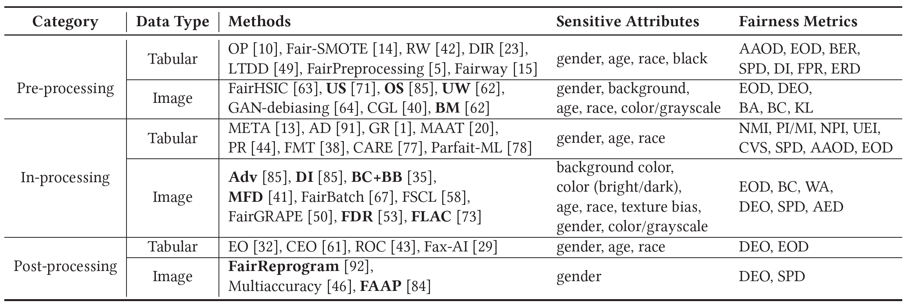

# A Large-Scale Empirical Study on Improving the Fairness of Image Classification Models

This is the implementation repository of our ISSTA 2024 paper: **[A Large-Scale Empirical Study on Improving the Fairness of Image Classification Models](https://arxiv.org/abs/2401.03695)**.

## 1. Description

Fairness has been a critical issue that affects the adoption of deep learning models in real practice. To improve model fairness, many existing methods have been proposed and evaluated to be effective in their own contexts. However, there is still no systematic evaluation among them for a comprehensive comparison under the same context, which makes it hard to understand the performance distinction among them, hindering the research progress and practical adoption of them. To fill this gap, this paper endeavours to conduct the first large-scale empirical study to comprehensively compare the performance of existing state-of-the-art fairness improving techniques. Specifically, we target the widely-used application scenario of image classification, and utilized three different datasets and five commonly-used performance metrics to assess in total 13 methods from diverse categories. Our findings reveal substantial variations in the performance of each method across different datasets and sensitive attributes, indicating over-fitting on specific datasets by many existing methods. Furthermore, different fairness evaluation metrics, due to their distinct focuses, yield significantly different assessment results. Overall, we observe that pre-processing methods and in-processing methods outperform post-processing methods, with pre-processing methods exhibiting the best performance. Our empirical study offers comprehensive recommendations for enhancing fairness in deep learning models. We approach the problem from multiple dimensions, aiming to provide a uniform evaluation platform and inspire researchers to explore more effective fairness solutions via a set of implications.



## 2. Structure

```bash
DL-Fairness-Study/
|-- BM                : implementation of US, OS, UW, BM, Adv, DI and BC+BB methods
|-- checkpoints       : saved models
|-- data              : image datasets
|-- FAAP              : implementation of FAAP method
|-- FDR               : implementation of FDR method
|-- figures           : figures of experimental result analysis
|-- FLAC              : implementation of FLAC method
|-- FR                : implementation of FR-B and FR-P methods
|-- log               : running log
|-- MFD               : implementation of MFD method
|-- model_checkpoints : saved models
|-- plot              : code to draw figures
|-- results           : ten repeated experimental results
|-- scripts           : running scripts
|-- arguments.py      : uniform arguments of all studied methods
|-- helper.py         : helper functions
|-- metrics.py        : performance and fairness evaluation metrics
|-- README.md         : user guide of our study
|-- requirements.txt  : dependencies required of the experiment
```

## 3. Datasets

We selected `3` datasets for conducting the empirical study. The table below provides a summary of these datasets, including the sensitive attribute considered in the study, the labels of the classification tasks, and the studied methods that previously used the same settings. Additionally, we present the number of instances used for model training and testing in each dataset, following existing studies.


Specifically, CelebA and UTKFace represent human-centric datasets that involve sensitive attributes (e.g., age and race) reflected in facial images, while CIFAR-10S is a more general dataset in fairness study, which introduces biases related to image colors of objects (non-facial images). They were previously used for evaluation by partial/all methods under different conditions, e.g., using different metrics. From the table we can also find that previous studies tend to employ different datasets, hindering their comprehensive comparison. In this study, we aim to provide an extensive study through a systematic evaluation by employing all of them, which vary in multiple perspectives.

**NOTE:** All datasets used in our study could be obtained from their homepages ([CelebA](https://mmlab.ie.cuhk.edu.hk/projects/CelebA.html), [UTKFace](https://susanqq.github.io/UTKFace/), [CIFAR-10](https://www.cs.toronto.edu/~kriz/cifar.html)). Please note that CIFAR-10S dataset used in our study is constructed by [Wang *et al.*](https://arxiv.org/abs/1911.11834) based on CIFAR-10 dataset.

## 4. Reproducibility

### 4.1. Environment

- Python: 3.8.18
- PyTorch: 1.10.1
- CUDA Version: 11.4
- GPU: NVIDIA GeForce RTX 3090
- OS: Linux (Ubuntu 20.04.6 LTS)
- CPU: Intel(R) Xeon(R) Gold 6326 CPU @ 2.90GHz

To facilitate other researchers in reproducing our `DL-Fairness-Study`, we provide a `docker` image for the experiment. It can be easily obtained by the following command:

```bash
docker pull junjie1003/fairness:latest

docker run -it --name fairness --gpus all --net host -v /your/local/path/:/data --shm-size="200g" junjie1003/fairness:latest /bin/bash

cd /root/DL-Fairness-Study
```

Then you will enter a container. Remember to change `/your/local/path/` to the real path.😊

### 4.2. Demo

Here is a demo and you can run `scripts/demo.sh` to have a quick start:

```bash
bash scripts/demo.sh
```

In the demo, we chose one representative method for each category in the `UTKFace-Race` dataset due to its low time cost. This allowed us to evaluate their accuracy and fairness, thereby demonstrating the variances in effectiveness among different method categories.

### 4.3. Running Studied Methods

#### Training

We provide scripts to train all the studied methods on `3` image datasets used in our study. You can execute them using the following commands:

```bash
bash scripts/celeba.sh
bash scripts/utkface.sh
bash scripts/cifar10s.sh
```

Please note that you need to modify the GPU ID to match your machine when you run these scripts.

#### Evaluation

After executing the training commands, you can evaluate the performance and fairness of these methods using your trained models. Additionally, you can utilize our saved models located in the `model_checkpoints` directory directly. Before you begin evaluation, simply move them to the `checkpoints` directory.

```bash
cp -r model_checkpoints/* checkpoints
```

If you want to evaluate all methods, you can run the following command:

```bash
bash scripts/test_celeba.sh
bash scripts/test_utkface.sh
bash scripts/test_cifar10s.sh
```

In our paper, we conducted 10 repeated experiments and recorded all the experimental results along with their mean and standard deviation in the `results` directory. The subsequent analysis and charts of experimental results are all based on these 10 repeated experiments.

## 5. Experimental Results

Please note that all the figures and tables in our paper are based on the results of 10 repeated experiments combined.

(1) Result comparison among different studied methods. The values in each cell denote the mean and standard deviation of the fairness metrics obtained from multiple experiments for the current method and dataset setting. We use different colors to highlight the values of different metrics, the darker of the color, the larger of the value, and the worse of the performance.


(2) Value distribution regarding accuracy metrics after applying different approaches on different datasets.


You can reproduce these boxplots by using our provided code `plot/boxplot_accuracy.py` and running the commands below:

```bash
cd plot
python boxplot_accuracy.py
```

(3) Pearson correlation across different metrics.


To generate the figure, you can run the `plot/pearson_correlation.py` code using the following command:

```bash
cd plot
python pearson_correlation.py
```

(4) Average time cost per epoch of each method for improving model fairness (in seconds).


## 6. Acknowledgement

We are deeply grateful to the authors of [Bias-Mimicking](https://github.com/mqraitem/Bias-Mimicking), [FLAC](https://github.com/gsarridis/FLAC), [Fair-Feature-Distillation-for-Visual-Recognition](https://github.com/DQle38/Fair-Feature-Distillation-for-Visual-Recognition), [Fairness-Finetuning](https://github.com/yuzhenmao/Fairness-Finetuning) and [Fairness-Reprogramming](https://github.com/UCSB-NLP-Chang/Fairness-Reprogramming) for making their code publicly available. It has enabled us to construct this repository based on their work.

If you have any further questions, please feel free to contact [Junjie Yang](jjyang@tju.edu.cn), [Jiajun Jiang](jiangjiajun@tju.edu.cn), [Zeyu Sun](zeyu.zys@gmail.com) and [Junjie Chen](junjiechen@tju.edu.cn).
